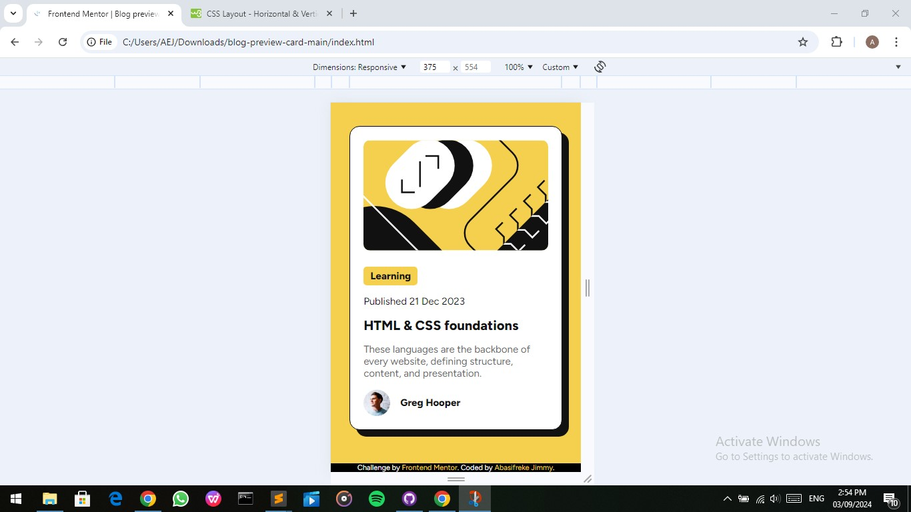
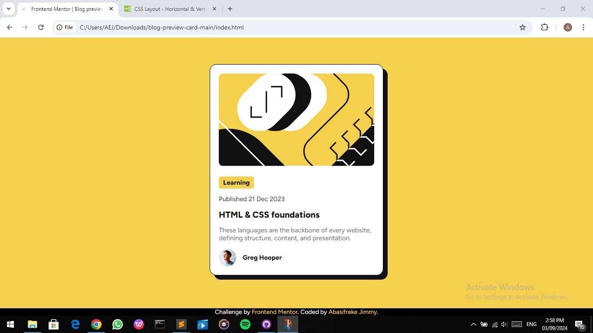

# Frontend Mentor - Blog preview card solution

This is a solution to the [Blog preview card challenge on Frontend Mentor](https://www.frontendmentor.io/challenges/blog-preview-card-ckPaj01IcS).

## Table of contents

- [Overview](#overview)
  - [The challenge](#the-challenge)
  - [Screenshot](#screenshot)
  - [Links](#links)
- [My process](#my-process)
  - [Built with](#built-with)
  - [What I learned](#what-i-learned)
  - [Continued development](#continued-development)
  - [Useful resources](#useful-resources)
- [Author](#author)
- [Acknowledgments](#acknowledgments)


## Overview

### The challenge

Users should be able to:
- See hover and focus states for all interactive elements on the page

### Screenshots




### Links

- Solution URL: (https://github.com/Abas-code/blog-preview-card-main)
- Live Site URL: (https://blog-preview-card-main-blond-theta.vercel.app/)


## My process

### Built with

- Semantic HTML5 markup
- CSS custom properties
- Flexbox
- Mobile-first workflow

### What I learned

I learnt how to use flexbox to centralize html block elements.

```css
main {
  display: flex;
  justify-content: center;
  align-items: center;
}
```

### Continued development

I will be looking up more 'semantic' ways of structuring and styling web pages and also learning the CSS Grid styling.
JavaScript is tough!

### Useful resources

- [W3Schools](https://www.w3schools.com) - This helped me for the Flexbox method of styling.


## Author

- Frontend Mentor - [@Abas-code](https://www.frontendmentor.io/profile/Abas-code)


## Acknowledgments

All thanks to W3Schools - most realiable source for web development.